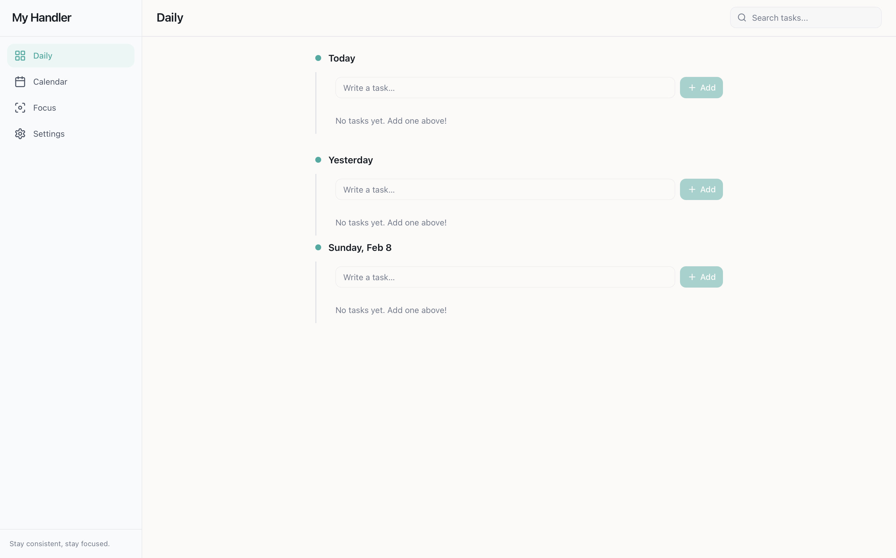

# My Handler

A beautiful, fast desktop task manager with Google Calendar integration. Built with Tauri, React, and TypeScript.

## Features

✅ **Task Management**
- Create, edit, and delete tasks
- Track task status: Not Started, Ongoing, Paused, Completed
- Set task priorities and deadlines
- Add detailed descriptions

⏱️ **Built-in Timer**
- Track time spent on tasks
- Pause and resume tracking
- Automatic time logging

📅 **Google Calendar Integration**
- Connect your Google Calendar
- Automatically create calendar events for tasks with deadlines
- Two-way sync: changes in app reflect in calendar
- Disconnect anytime

📊 **Multiple Views**
- **Daily View**: Focus on today's tasks organized by date
- **Calendar View**: See tasks across the month
- **Focus Mode**: Distraction-free single task view

🎨 **Clean Interface**
- Modern, intuitive design
- Dark/light theme support
- Responsive layout

## Installation

### Download

Download the latest version for your platform from [Releases](https://github.com/YarKhan02/MyHandler/releases):

- **macOS**: `.dmg` or `.app.tar.gz`
- **Windows**: `.msi` or `.exe`
- **Linux**: `.deb`, `.rpm`, or `.AppImage`

### macOS Note

If you see "app is damaged" error on macOS:
```bash
xattr -cr /Applications/My\ Handler.app
```

Then reopen the app.

## Usage

### Managing Tasks

1. **Create Task**: Click the "+" button or press `Ctrl/Cmd + N`
2. **Edit Task**: Click on a task to edit details
3. **Change Status**: Use the status dropdown or action buttons
4. **Delete Task**: Click the delete button (⋮ menu)

### Using the Timer

1. Select a task
2. Click "Start" to begin tracking time
3. Click "Pause" to pause, "Stop" to finish
4. Time automatically logs to your task

### Connecting Google Calendar

1. Go to **Settings**
2. Click **"Connect Calendar"**
3. Sign in with your Google account
4. Authorize calendar access
5. Done! Tasks with deadlines will sync automatically

### Views

- **Daily**: See tasks organized by date sections
- **Calendar**: Monthly view of all tasks
- **Focus**: Single-task mode for deep work

## App Preview


## Tech Stack

- **Frontend**: React, TypeScript, Vite
- **UI**: shadcn/ui, Tailwind CSS
- **Backend**: Rust, Tauri
- **Database**: SQLite
- **OAuth**: Google OAuth 2.0

## License

Copyright © 2026 YarKhan. All rights reserved.

## Support

Found a bug or have a feature request? [Open an issue](https://github.com/YarKhan02/MyHandler/issues)
